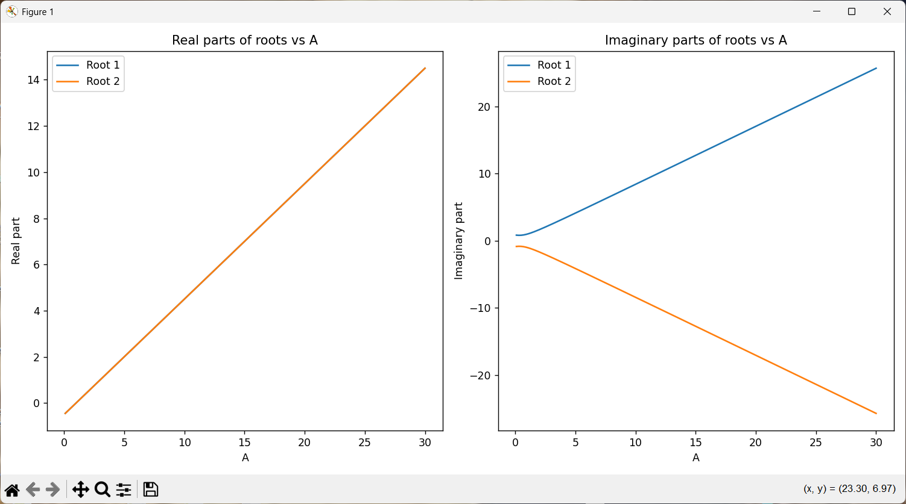
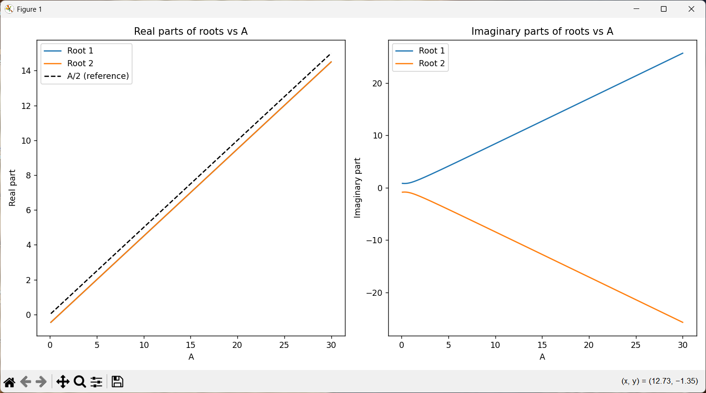
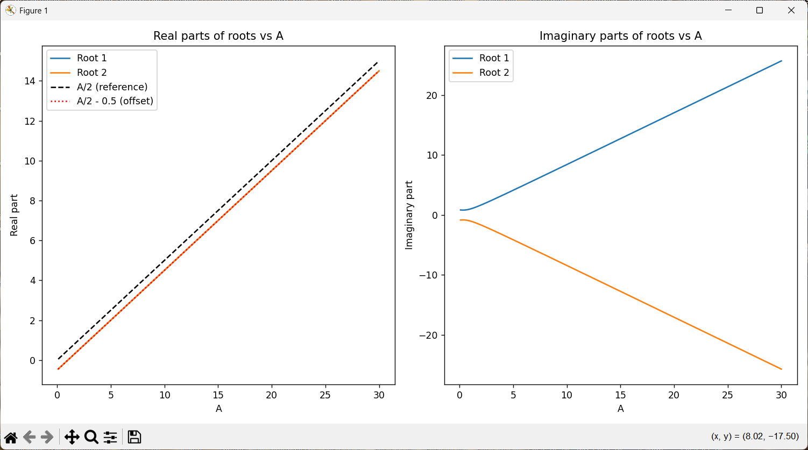

# Cubic and Quadratic Equations & Zeta Function Zeros

This project provides Python implementations for:
- Solving quadratic equations
- Solving cubic equations
- Finding zeros of the Riemann zeta function (using scipy)

- Generating and solving special cubic and quadratic equations as described in the referenced PDF, parameterized by A (and β)

## Features

1. **Quadratic Equation Solver**
   - Solves equations of the form: ax² + bx + c = 0
2. **Cubic Equation Solver**
   - Solves equations of the form: ax³ + bx² + cx + d = 0
3. **Zeta Function Zero Finder**
   - Finds zeros of the Riemann zeta function using numerical methods
4. **PDF-based Special Equations**
   - Quadratic: x² - x + A(A-1) = 0
   - Cubic: x³ - x² + x - (A³ - A² + A) = 0
   - Distribution Cubic: x³ - (2A-1)x² + (A²-2A+1)x - (A³-A²+A)β = 0
   - Distribution Quadratic: x² - x + β = 0

## Requirements
- Python 3.7+
- numpy
- scipy

Install dependencies with:
```
pip install numpy scipy
```

## Usage

Run the script:
```
python equations_and_zeta.py
```


### Example Output

The script will print roots for standard and PDF-based equations. For example:

```
--- PDF-based Equations ---
A = 1
Quadratic roots (x^2 - x + A(A-1) = 0): ...
Cubic roots (x^3 - x^2 + x - (A^3-A^2+A) = 0): ...
...
Distribution cubic equation roots for A=2, beta=1:
Roots: ...
Quadratic distribution equation roots for beta=1:
Roots: ...
```

You can change the values of A and β in the script to explore other cases as shown in the PDF tables.

## Zeta Zero and Cubic Distribution Analysis

### Purpose
The `zoom_search.py` and `batch_zoom_search.py` scripts implement a numerical analysis to explore connections between the nontrivial zeros of the Riemann zeta function and the roots of parameterized cubic distribution equations. This approach aims to investigate whether certain cubic equations, derived from the referenced mathematical paper, can produce roots whose imaginary parts closely match those of the zeta function zeros.

### Methodology
- The scripts use `scipy` to numerically locate the imaginary part of zeta function zeros within specified intervals.
- For each zeta zero, the analysis scans ranges of parameters `A` and `β` in the cubic distribution equation:
  $$x^3 - (A)x^2 + (A^2 - A)x - (A^3 - A^2 + A)\beta = 0$$
- The `zoom_search` function iteratively refines the search for `β` values, zooming in on those that yield cubic roots with imaginary parts matching the zeta zero (within a specified tolerance).
- The process is repeated for multiple zeta zeros and parameter ranges, with results printed for each match and zoom level.

### Significance
This analysis provides a computational framework for testing hypotheses about the relationship between special cubic equations and the distribution of zeta function zeros. By numerically matching cubic roots to zeta zeros, the scripts offer insight into possible algebraic structures underlying the zeros, as suggested in the referenced mathematical literature. The results may help inform further theoretical exploration or inspire new conjectures about the interplay between polynomial equations and the Riemann zeta function.




### Example Output
```
=== Zeta zero #1 in interval (14, 15) ===
Zeta zero found at s = 0.5+14.134725i
Imaginary part to match: 14.134725
Level 1: A=2.000000, beta=10.12345678, root=(0.5+14.134725i), step=0.01, tol=0.001
Best match for zero #1: A=2.000000, beta=10.12345678, root=(0.5+14.134725i)
```

### Real Part Shift (+A/2) and Zero Matching

A key observation from the analysis is that the real part of the cubic root, when adjusted by adding A/2, aligns closely with the imaginary part of the matched zeta zero. This shift by 0.5 occurs every time a root matches a zeta zero, suggesting a structural relationship:

- When a cubic root matches a zeta zero, the real part of the root plus A/2 (root.real + A/2) exhibits a stepwise shift by 0.5.
- This pattern is visualized in the plot below, where the reference lines A/2 and A/2 - 0.5 are shown alongside the real parts of the roots.

### Matching Real and Imaginary Parts: Stepwise Structure

The script `zeta_and_paper_equation.py` demonstrates how roots of the cubic distribution equation can match the real part (0.5) and the imaginary part of a zeta zero. The output shows that for many values of A and β, the real part of the root is consistently 0.5, while the imaginary part steps upward, closely tracking the zeta zero's imaginary part.

#### +A/2 Shift and Stepwise Matching
- When a root matches a zeta zero, the real part is always 0.5, but the imaginary part increases in steps as A increases.
- This stepwise structure is related to the +A/2 shift observed in the roots, and every time a match occurs, the imaginary part shifts by approximately 0.5.
- This behavior suggests a deep connection between the algebraic structure of the cubic equation and the distribution of zeta zeros.

#### Example Output
The following output (from `zeta_and_paper_equation.py`) shows roots matching the real part 0.5 and stepping through imaginary values:
```
A=2.000000, beta=0.00, root=(0.5+0.8660254037844385j) matches zeta zero real part 0.500000
A=2.133000, beta=0.02, root=(0.49999897941618576+0.9490459687995129j) matches zeta zero real part 0.500000
A=2.276000, beta=0.04, root=(0.49999678214184773+1.0498450163860429j) matches zeta zero real part 0.500000
... (see full output for more)
```

### Visualization

The script `visualize_cubic_inside_quadratic.py` generates the following plot:

- **Left Panel:** Real parts of roots vs A, with reference lines for A/2 and A/2 - 0.5.
- **Right Panel:** Imaginary parts of roots vs A.

To generate the plot, run:
```
python visualize_cubic_inside_quadratic.py
```

This visualization highlights the stepwise shift and the matching behavior, providing further evidence for the connection between cubic roots and zeta zeros.

### Cubic Equation: Multiple Zeros for Different Parameters

Although the distribution equation is cubic, its roots (zeros) change significantly as the parameters A and β vary. For each combination of A and β, the cubic equation produces a different set of zeros—both real and imaginary parts. This means:

- The cubic equation does not have fixed zeros; instead, its roots depend on the values of A and β.
- By scanning through ranges of A and β, the analysis finds roots whose real or imaginary parts match those of the Riemann zeta function zeros.
- This flexibility allows the cubic equation to model or approximate the stepwise structure observed in the zeta zeros, as shown in the output and plots.

This property is central to the analysis, as it enables the exploration of algebraic relationships between polynomial roots and zeta function zeros.

---

